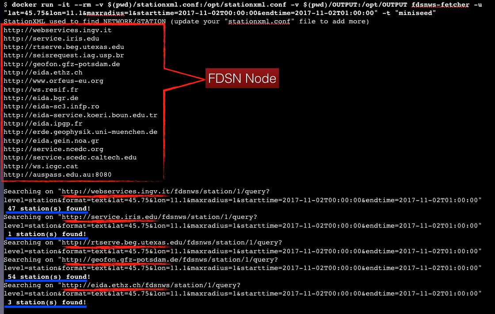

[![TeamDigitale-publiccode](https://img.shields.io/badge/publiccode%20compliant-%E2%9C%94-blue.svg?logo=data:image/png;base64,iVBORw0KGgoAAAANSUhEUgAAAA4AAAAOCAMAAAAolt3jAAAAIGNIUk0AAHomAACAhAAA+gAAAIDoAAB1MAAA6mAAADqYAAAXcJy6UTwAAAFxUExURQBmzABmzABmzABkywBkywBmzABmzABmzApszj2L2CyA1QBmzABmzABmzABlzABkywBlzABmzABkywBkywBkyyZ91OXv+qTH7AJlzABlzABmzABlzBJx0Hiu5EyU2wBmzECM2Wil4RRy0CZ91Orz+8/i9W2n4h950gBlzABkyzuJ2Pb6/bbT8AVpzZbA6vX5/TOE1iR80+jx+vn8/uXv+kKO2QBjywBlzA9vz3Cp4kmS2wBlzJbA6vX5/TOE1uvz+7LR8Ch+1AttzgBmzABmzABkywBkywBlzJbA6uz0+6PH7AFlzABmzABmzABlzJbA6jOE1iR70+z0+6TH7AFky5bA6jOF1hx30uPu+c/i9V+f3xl10QBlzABmzABlzIi459/s+TCD1gVpzZ7F7Pb6/evz+0CM2QBjywBmzBd00SV80whrzgBlzBFwzzqJ2DaG1wttzgBmzABmzABlzABlzABmzABmzABkywBkywBmzP///7f5b6EAAAABYktHRHo41YVqAAAAB3RJTUUH4wUWBTMYAFp7MgAAAF50RVh0UmF3IHByb2ZpbGUgdHlwZSBpcHRjAAppcHRjCiAgICAgIDI4CjM4NDI0OTRkMDQwNDAwMDAwMDAwMDAwZjFjMDI2ZTAwMDM1MjQ2NDcxYzAyMDAwMDAyMDAwNDAwCmCaPZ4AAAClSURBVAjXY2DAChiZmFlYwSw2EMHOwcnFzcPAwMvHLyAoJCwiKiYuISnFIC0jKyevoKikrKKqpq7BoKmlraOrp29gaGRsYmrGYG5haWVtY2tnaO/g6OTMwOvi6ubuAeR6enn7+IJMZfXztw0IDAoOkZaCcEP1w8IjIqOiY0Dc2Lj4hMSk5JTUtHSwOzIys7JzcvPyCwrB7ioqLiktMy+vqPRFczoAaG4fQ5lQVPsAAAAldEVYdGRhdGU6Y3JlYXRlADIwMTktMDUtMjJUMDU6NTE6MjQtMDQ6MDDV7wZaAAAAJXRFWHRkYXRlOm1vZGlmeQAyMDE5LTA1LTIyVDA1OjUxOjI0LTA0OjAwpLK+5gAAAABJRU5ErkJggg==)](https://github.com/italia/publiccode.yml)
[![TeamDigitale-reuse](https://img.shields.io/badge/reuse%20software-%E2%9C%94-blue.svg?logo=data:image/png;base64,iVBORw0KGgoAAAANSUhEUgAAAA4AAAAOCAMAAAAolt3jAAAAIGNIUk0AAHomAACAhAAA+gAAAIDoAAB1MAAA6mAAADqYAAAXcJy6UTwAAAFxUExURQBmzABmzABmzABkywBkywBmzABmzABmzApszj2L2CyA1QBmzABmzABmzABlzABkywBlzABmzABkywBkywBkyyZ91OXv+qTH7AJlzABlzABmzABlzBJx0Hiu5EyU2wBmzECM2Wil4RRy0CZ91Orz+8/i9W2n4h950gBlzABkyzuJ2Pb6/bbT8AVpzZbA6vX5/TOE1iR80+jx+vn8/uXv+kKO2QBjywBlzA9vz3Cp4kmS2wBlzJbA6vX5/TOE1uvz+7LR8Ch+1AttzgBmzABmzABkywBkywBlzJbA6uz0+6PH7AFlzABmzABmzABlzJbA6jOE1iR70+z0+6TH7AFky5bA6jOF1hx30uPu+c/i9V+f3xl10QBlzABmzABlzIi459/s+TCD1gVpzZ7F7Pb6/evz+0CM2QBjywBmzBd00SV80whrzgBlzBFwzzqJ2DaG1wttzgBmzABmzABlzABlzABmzABmzABkywBkywBmzP///7f5b6EAAAABYktHRHo41YVqAAAAB3RJTUUH4wUWBTMYAFp7MgAAAF50RVh0UmF3IHByb2ZpbGUgdHlwZSBpcHRjAAppcHRjCiAgICAgIDI4CjM4NDI0OTRkMDQwNDAwMDAwMDAwMDAwZjFjMDI2ZTAwMDM1MjQ2NDcxYzAyMDAwMDAyMDAwNDAwCmCaPZ4AAAClSURBVAjXY2DAChiZmFlYwSw2EMHOwcnFzcPAwMvHLyAoJCwiKiYuISnFIC0jKyevoKikrKKqpq7BoKmlraOrp29gaGRsYmrGYG5haWVtY2tnaO/g6OTMwOvi6ubuAeR6enn7+IJMZfXztw0IDAoOkZaCcEP1w8IjIqOiY0Dc2Lj4hMSk5JTUtHSwOzIys7JzcvPyCwrB7ioqLiktMy+vqPRFczoAaG4fQ5lQVPsAAAAldEVYdGRhdGU6Y3JlYXRlADIwMTktMDUtMjJUMDU6NTE6MjQtMDQ6MDDV7wZaAAAAJXRFWHRkYXRlOm1vZGlmeQAyMDE5LTA1LTIyVDA1OjUxOjI0LTA0OjAwpLK+5gAAAABJRU5ErkJggg==)](https://developers.italia.it/it/software/ingv-ingv-fdsnws-fetcher)

[](https://github.com/INGV/fdsnws-fetcher/blob/master/LICENSE)

[](https://hub.docker.com/r/ingv/fdsnws-fetcher)


[](https://github.com/INGV/fdsnws-fetcher/issues)


# fdsnws-fetcher [](https://github.com/INGV/fdsnws-fetcher/blob/master/publiccode.yml) | [](https://github.com/INGV/fdsnws-fetcher/actions)

This Docker is used to retrieve:
- "**paz**": Poles and zeros file(s)
- "**sac**": Dataless file(s)
- "**resp**": Response file(s)
- "**dless**": Dataless file(s)
- "**miniseed**": MiniSeed file(s)
- "**stationxml**": StationXML file(s)
- "**dataselect_list**": A list of **dataselect** URL used to download MiniSeed

sending a request to each "**station**" FDSNS-WS to find available stations.

## Quickstart
### Clone the repository
First, clone the git repositry:
```
$ git clone https://github.com/INGV/fdsnws-fetcher.git
$ cd fdsnws-fetcher
```

### Docker image
To obtain *fdsnws-fetcher* docker image, you have two options:

#### 1) Get built image from DockerHub (*preferred*)
Get the last built image from DockerHub repository:
```
$ docker pull ingv/fdsnws-fetcher:latest
```

#### 2) Build by yourself
```
$ docker build --tag ingv/fdsnws-fetcher . 
```

in case of errors, try:
```
$ docker build --no-cache --pull --tag ingv/fdsnws-fetcher . 
```

### Run docker
Running the command below to see the **help**:
```
$ docker run -it --user $(id -u):$(id -g) --rm -v $(pwd)/stationxml.conf:/opt/stationxml.conf -v $(pwd)/OUTPUT:/opt/OUTPUT ingv/fdsnws-fetcher -h

 This docker search the given STATIONXML_PARAMETERS on StationXML and convert it to RESP or DATALESS files or DATASELECT_LIST list.

  Print software version number:
  $ docker run -it --rm ingv/fdsnws-fetcher -v

  Usage:
  $ docker run -it --rm --user $(id -u):$(id -g) -v $(pwd)/stationxml.conf:/opt/stationxml.conf -v $(pwd)/OUTPUT:/opt/OUTPUT ingv/fdsnws-fetcher -u <stationxml params>

    Values for option -t: resp, paz, dless, stationxml, dataselect_list, miniseed, sac

    Examples:
     1) $ docker run -it --rm ingv/fdsnws-fetcher -v
     2) $ docker run -it --rm --user $(id -u):$(id -g) -v $(pwd)/stationxml.conf:/opt/stationxml.conf -v $(pwd)/OUTPUT:/opt/OUTPUT ingv/fdsnws-fetcher -u "network=IV&station=ACER&starttime=2017-11-02T00:00:00&endtime=2017-11-02T01:00:00" -t "dataselect_list"
     3) $ docker run -it --rm --user $(id -u):$(id -g) -v $(pwd)/stationxml.conf:/opt/stationxml.conf -v $(pwd)/OUTPUT:/opt/OUTPUT ingv/fdsnws-fetcher -u "network=IV&latitude=42&longitude=12&maxradius=1" -t "dataselect_list"
     4) $ docker run -it --rm --user $(id -u):$(id -g) -v $(pwd)/stationxml.conf:/opt/stationxml.conf -v $(pwd)/OUTPUT:/opt/OUTPUT ingv/fdsnws-fetcher -u "network=IV&latitude=47.12&longitude=11.38&maxradius=0.5&channel=HH?,EH?,HN?" -t "dataselect_list"
     5) $ docker run -it --rm --user $(id -u):$(id -g) -v $(pwd)/stationxml.conf:/opt/stationxml.conf -v $(pwd)/OUTPUT:/opt/OUTPUT ingv/fdsnws-fetcher -u "network=IV,MN&station=BLY&starttime=2017-11-02T00:00:00&endtime=2017-11-02T01:00:00" -t "dless"
     6) $ docker run -it --rm --user $(id -u):$(id -g) -v $(pwd)/stationxml.conf:/opt/stationxml.conf -v $(pwd)/OUTPUT:/opt/OUTPUT ingv/fdsnws-fetcher -u "lat=45.75&lon=11.1&maxradius=1&starttime=2017-11-02T00:00:00&endtime=2017-11-02T01:00:00" -t "resp,dless"
     7) $ docker run -it --rm --user $(id -u):$(id -g) -v $(pwd)/stationxml.conf:/opt/stationxml.conf -v $(pwd)/OUTPUT:/opt/OUTPUT ingv/fdsnws-fetcher -u "lat=45.75&lon=11.1&maxradius=1&starttime=2017-11-02T00:00:00&endtime=2017-11-02T01:00:00" -t "miniseed,resp"
     8) $ docker run -it --rm --user $(id -u):$(id -g) -v $(pwd)/stationxml.conf:/opt/stationxml.conf -v $(pwd)/OUTPUT:/opt/OUTPUT ingv/fdsnws-fetcher -u "lat=45.75&lon=11.1&maxradius=1&starttime=2017-11-02T00:00:00&endtime=2017-11-02T01:00:00" -t "sac,dataselect_list"

    Example with auth token for restricted stations:
     1) $ docker run -it --rm --user $(id -u):$(id -g) -v $(pwd)/stationxml.conf:/opt/stationxml.conf -v $(pwd)/OUTPUT:/opt/OUTPUT -v $(pwd)/my_token:/opt/token ingv/fdsnws-fetcher -u "network=IV&station=ACER&starttime=2017-11-02T00:00:00&endtime=2017-11-02T01:00:00" -t "dataselect_list"
     2) $ docker run -it --rm --user $(id -u):$(id -g) -v $(pwd)/stationxml.conf:/opt/stationxml.conf -v $(pwd)/OUTPUT:/opt/OUTPUT -v $(pwd)/my_token:/opt/token ingv/fdsnws-fetcher -u "lat=45.75&lon=11.1&maxradius=1&starttime=2017-11-02T00:00:00&endtime=2017-11-02T01:00:00" -t "miniseed,resp"
     3) $ docker run -it --rm --user $(id -u):$(id -g) -v $(pwd)/stationxml.conf:/opt/stationxml.conf -v $(pwd)/OUTPUT:/opt/OUTPUT -v $(pwd)/my_token:/opt/token ingv/fdsnws-fetcher -u "lat=45.75&lon=11.1&maxradius=1&starttime=2017-11-02T00:00:00&endtime=2017-11-02T01:00:00" -t "sac"

$
```

The output data is into the `./OUTPUT` local directory.

### Example screenshot


### Enter into the Docker
To override the `ENTRYPOINT` directive and enter into the Docker images, run:
```
$ docker run -it --user $(id -u):$(id -g) --rm -v $(pwd)/OUTPUT:/opt/OUTPUT -v $(pwd)/stationxml.conf:/opt/stationxml.conf --entrypoint=bash ingv/fdsnws-fetcher
```
or with `root`:
```
$ docker run -it --rm -v $(pwd)/OUTPUT:/opt/OUTPUT -v $(pwd)/stationxml.conf:/opt/stationxml.conf --entrypoint=bash ingv/fdsnws-fetcher
```

## Update Docker image from DockerHub
Get last Docker image from DockerHub repository:
```
$ docker pull ingv/fdsnws-fetcher
```

## Update `stationxml.conf`
Update your `stationxml.conf` adding more StationXML entry point.

From version `v2.30.0`, the file `stationxml.conf` was update to support three columns:
- fdsn *station* node. **mandatory**
- additional `GET` paramas for *station* node
- different *dataselect* node to submit waveforms request. Default is equal to *station* node

the syntax is:
```
<stationxml_node>|<additional_GET_params>|<dataselect_node>
```

for example:
```
http://webservices.ingv.it|authoritative=any|http://eidaws-internal.int.ingv.it:8080
http://service.iris.edu
http://rtserve.beg.utexas.edu
http://seisrequest.iag.usp.br
```

the line `http://webservices.ingv.it|authoritative=any|http://eidaws-internal.int.ingv.it:8080` will be used to:
- request stations info from `http://webservices.ingv.it` adding `authoritative=any` to the request (`http://webservices.ingv.it/fdsnws/station/1/query?authoritative=any&<other_params>`
- request the waveforms to the *dataselect* node: `http://eidaws-internal.int.ingv.it/fdsnws/dataselect/1/query?<params>`

# Build multi arch docker image
Create multi-arch builder and use it:
```
docker buildx create \
  --name container-builder \
  --driver docker-container \
  --use
```

list builders:
```
docker buildx ls
```

build multi-arch image with `container-builder` builder:
```
docker buildx build \
  --platform linux/amd64,linux/arm64 \
  -t ingv/fdsnws-fetcher:latest .
```

return to `default` builder:
```
docker buildx use default
```

NOTE:
- the `build` command, build the images but do not export it on your local registry; to do that, use `--load` option BUT it works only with one `platform`. i.e: `docker buildx build --platform linux/amd64 --load -t ingv/fdsnws-fetcher:latest`
- to push the image with both architectures, use `--push` option: i.e.: ``docker buildx build --platform linux/amd64,linux/arm64 --push -t ingv/fdsnws-fetcher:latest .`

# Contribute
Thanks to your contributions!

Here is a list of users who already contributed to this repository: \
<a href="https://github.com/ingv/fdsnws-fetcher/graphs/contributors">
  
</a>

# Author
(c) 2024 Valentino Lauciani valentino.lauciani[at]ingv.it

Istituto Nazionale di Geofisica e Vulcanologia, Italia
